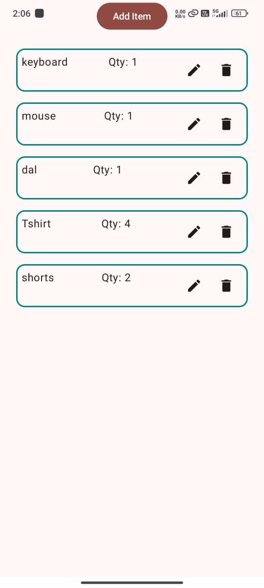
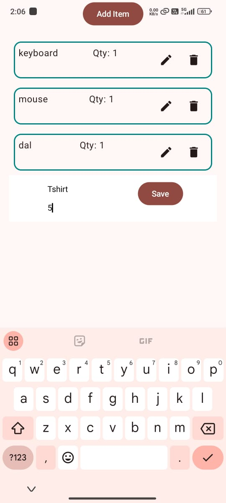

# Shopping List App - A Jetpack Compose Project

This project is a foundational example of a shopping list application built using the modern Android toolkit, Jetpack Compose. It demonstrates fundamental concepts of Compose development, including state management, UI design, and user interaction.

## Core Functionalities:

- **Dynamic Item Management:** Users can seamlessly add, edit, and delete shopping items. The app utilizes a dynamic list to display items, ensuring efficient rendering even with large lists.
- **Add Item Dialog:** A user-friendly dialog facilitates the addition of new items. It includes input fields for the item name and quantity, ensuring structured data entry.
- **Item Editing:** Existing items can be modified directly within the list. Clicking on an item transitions it into an editing mode, allowing for changes to its name and quantity.
- **Item Deletion:** Items can be removed from the list with a simple action, providing a streamlined way to manage the shopping list.

## Technical Implementation:

- **Jetpack Compose:** The entire user interface is constructed using Jetpack Compose, a declarative UI toolkit that simplifies UI development and enhances app performance.
- **State Management:** Compose's state management capabilities are utilized to manage the list of shopping items and control UI elements like the "Add Item" dialog.
- **Material Design 3:** The app adheres to Material Design 3 guidelines, ensuring a visually appealing and consistent user experience.
- **Kotlin:** The project is written in Kotlin, a modern programming language that enhances code readability and conciseness.

  ### Screenshots

## Potential Enhancements & Learning Opportunities:

This project serves as a starting point for a more comprehensive shopping list application. Here are some potential areas for expansion and learning:

- **Data Persistence:** Implement data persistence using technologies like Room or SharedPreferences to store the shopping list and ensure data is retained across app sessions.
- **Advanced Features:** Introduce features like item categorization, sorting options, and the ability to check off completed items.
- **UI/UX Refinement:** Enhance the user interface with animations, custom transitions, and more interactive elements to create a more engaging experience.
- **Cloud Synchronization:** Explore cloud-based solutions like Firebase to enable list synchronization across multiple devices and user accounts.
- **Testing:** Implement unit and integration tests to ensure code quality and functionality.

## Contribution Guidelines:

This project welcomes contributions from the developer community. If you're interested in contributing, consider the following:

- **Bug Fixes:** Identify and resolve any existing bugs or issues.
- **New Features:** Implement new functionalities based on the suggested enhancements or your own ideas.
- **UI/UX Improvements:** Contribute to enhancing the visual design and user experience of the app.
- **Code Refactoring:** Improve code structure, readability, and efficiency.

Before submitting a pull request, ensure your code adheres to the project's coding style and includes appropriate tests.

## License:

This project is open-source and available under the permissive MIT License. You are free to use, modify, and distribute the code for personal or commercial purposes.
